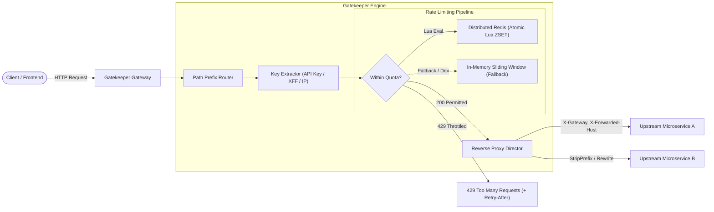

# 🛡️ Gatekeeper

[](https://go.dev/)
[]()
[]()

**Gatekeeper** is a high-performance, production-ready distributed API Gateway and reverse proxy engine written in Go. It is designed from first principles to provide sub-millisecond request routing, granular path rewriting, and atomic rolling-window rate limiting backed by distributed Redis or in-memory stores.

---

## 🏛️ Architecture Overview

Gatekeeper sits at the edge of your infrastructure, intercepting incoming HTTP traffic and enforcing traffic policies before dispatching requests to upstream microservices:



---

## ✨ Key Features

* **⚡ Ultra Low-Latency Reverse Proxy**: Built on Go's optimized `net/http/httputil` with custom connection pooling, idle connection pruning, and TLS handshake timeouts.
* **🔒 Atomic Sliding-Window Rate Limiting (Redis + Lua)**:
  * Uses Redis Sorted Sets (`ZSET`) driven by an **atomic Lua script** (`SlidingWindowLuaScript`).
  * Eliminates the classic **boundary burst problem** of fixed-window algorithms (where a client can send 2x their quota across the boundary minute).
  * 100% thread-safe and cluster-safe with zero distributed race conditions.
  * **SRE-grade Fail-Open Policy**: If Redis experiences network degradation or downtime, Gatekeeper logs structured warnings and fails open to avoid cascading upstream outages.
* **🚀 In-Memory Sliding-Window Engine**: High-performance synchronized rolling window for local development and non-clustered environments.
* **📊 Standard RFC Observability Headers**:
  * `X-RateLimit-Limit`: Maximum quota allowed within the active window.
  * `X-RateLimit-Remaining`: Remaining request allowance.
  * `X-RateLimit-Reset`: Rolling window expiration delta (seconds).
  * `Retry-After`: Exact backoff period required before retrying when throttled (HTTP 429).
* **🎯 Granular Route Definitions**: Support for custom path prefixes, target URL rewrites, strip-prefix rules, and individual route-level rate limits.
* **🩺 Health Checks & Graceful Draining**: Native `/healthz` endpoints and signal trapping (`SIGINT`, `SIGTERM`) with a 10-second timeout context for connection draining.

---

## ⏱️ Benchmark: 4.7 Million Rate Checks / Second

Benchmarked on standard hardware running Go parallel tests (`go test -bench="." -benchmem ./internal/limiter`):

```text
pkg: github.com/aman-shri/gatekeeper/internal/limiter
cpu: Intel(R) Core(TM) i5-10210U CPU @ 1.60GHz
BenchmarkMemoryLimiter_Allow-8    4,701,055 ops    223.3 ns/op    57 B/op    2 allocs/op
```

---

## 🚀 Quickstart

### 1. Run the Gateway
```bash
git clone https://github.com/aman-shri/gatekeeper.git
cd gatekeeper

# Run with in-memory limiter (default)
go run ./cmd/gateway
```

### 2. Enable Distributed Redis Rate Limiting
```bash
export REDIS_ENABLED=true
export REDIS_HOST=localhost
export REDIS_PORT=6379
export REDIS_PASSWORD=

go run ./cmd/gateway
```

### 3. Verify Health & Route Proxying
```bash
# Gateway Health Check
curl -i http://localhost:8080/healthz

# Proxy Request through rate-limited route
curl -i http://localhost:8080/api/v1/mock/get
```

When rate limits are exceeded, Gatekeeper responds with an HTTP 429:
```http
HTTP/1.1 429 Too Many Requests
Content-Type: application/json
Retry-After: 4
X-RateLimit-Limit: 100
X-RateLimit-Remaining: 0
X-RateLimit-Reset: 60

{
  "error": "RATE_LIMIT_EXCEEDED",
  "message": "Rate limit quota of 100 requests per 1m0s exceeded. Please slow down.",
  "path": "/api/v1/mock/get",
  "status": 429,
  "retry_after_seconds": 4
}
```

---

## 🧪 Testing

Run all unit, integration, and concurrency tests:
```bash
go test -v ./...
```

Run benchmarks:
```bash
go test -bench="." -benchmem ./internal/limiter
```

---

## 🗺️ Roadmap
- [x] **Phase 1**: Core Architecture (Go module, config loader, reverse proxy engine)
- [x] **Phase 2**: Atomic Sliding-Window Rate Limiter (Redis Lua + Memory engine + Middleware)
- [ ] **Phase 3**: Auth & Token Validation (JWT verification, API Key multi-tenancy, structured `slog` context)
- [ ] **Phase 4**: Load Testing & Profiling (`pprof`, distributed latency benchmarks)
- [ ] **Phase 5**: Production Readiness (Docker Compose stack, GitHub Actions CI/CD)
